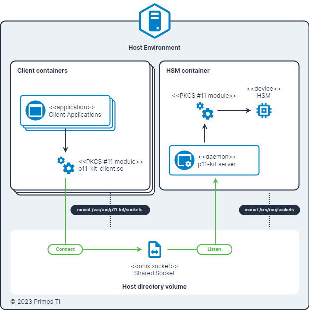

# Samples of how to use Virtual PKCS #11 Module SoftHSMv2 by Primos TI

PKCS #11 is a standard to standard defines a library interface to access and operate cryptographic tokens, such as
hardware security modules (HSM), smart cards, etc. This standard are implemented by different vendors, and the
implementation of this standard is called PKCS #11 module. With a PKCS #11 module, it is possible to access a token and
operate with its key material. For example, to generate a key pair, to sign a message, to encrypt data, etc.
Independently of the token vendor.

SoftHSMv2 is an implementation of a cryptographic store accessible through a PKCS #11 interface. You can use it to
explore PKCS #11 without having a Hardware Security Module. It is being developed as a part of the OpenDNSSEC project.

# Sharing HSM tokens with PKCS #11

Sometimes may be useful to share a HSM token remotely. This can be done by using a very useful PKCS #11 set of tools
called [p11-kit]. This set of tools provides a PKCS #11 server and client. The `p11-kit server` command starts a server
that exposes a PKCS #11 module via a [Unix Domain Socket]. The `p11-kit-client.so` is a PKCS #11 module that can be used
on the client side to connect to the server and operate with the token.

This is useful, for example, to protect a key material available to other applications, maintaining these
materials isolated and protected. As example, consider the following scenarios:

- Connect to a SSH server using a key material;
- Stablish a mutual TLS connection using a key material;
- Store certificates and keys available to applications running on other containers;

Normally, on this scenarios, when a key material is needed, these keys are stored in a file (encrypted by a password - 
*I hope*) and the application accesses the file to read the key material (with the password). This is not safe, because
the key material can be exposed, if the application is compromised. With a PKCS #11 token, the key material access is
protected by a PIN and the application can only operate with the key material, not reading it.

## Sharing HSM tokens to the host applications

You may think: *"I don't need to share the token to operate a local token with local applications. I can use the token
PKCS #11 module directly."*. Yes, you may be right! But, if you want isolate the token access infrastructure? Or, if you
want to share the token to operate with the token remotely.

First, to isolate the token access infrastructure, you can use a container to run the token server on a isolated and
protected environment.

Second, to share the token to operate with the token remotely, you can use the `p11-kit server` command to start a
server that exposes the token PKCS #11 module via a [Unix Domain Socket]. Note that you must mount the socket on a
volume, shared with the host. Then, on the host, you can use the `p11-kit-client.so` PKCS #11 module to connect to the
server and operate with the token.

The following diagram illustrates the scenario:

## Sharing HSM tokens to another containers applications on the same host

The same scenario described [above](#sharing-hsm-tokens-to-the-host-applications) can be used to share the token to
another containers applications on the same host. The difference is that the shared socket must be mounted on a volume
in the client containers.

The following diagram illustrates the scenario:

## Sharing HSM tokens examples

The following examples show how to share a token to operate with the token remotely.

- [Sharing HSM tokens to another host over network with SSL/TLS](./share-token-over-ssl/).
- [Sharing HSM tokens to another host over network with SSH](./share-token-over-ssh/).
- Sharing HSM tokens over a web API (concepts) (soon).

## Security considerations

**Warning:** Sharing the token remotely can have security implications. Take security measures to protect the token from
unauthorized access.

Some security measures includes:

- Use strong Security Officer (SO) PIN and User PIN to protect the token.
- Define a specific user and group for the container.
- Set the permissions of the exposed socket to be accessible only by a specific user and group.
- When sharing the token over network, use a secure connection with mutual authentication (e.g. TLS).
- Protect the access to the SoftHSMv2 storage. Read more about [SoftHSMv2 storage internals].

> YOU MUST ANALYZE YOUR OWN SCENARIO AND TAKE THE APPROPRIATE SECURITY MEASURES, BY YOUR OWN RISK.

# License

Copyright © 2023 Primos TI

This project is licensed under the MIT License - see the [LICENSE](LICENSE) file for details.

[p11-kit]: https://p11-glue.github.io/p11-glue/p11-kit.html
[Unix Domain Socket]: https://man7.org/linux/man-pages/man7/unix.7.html
[SoftHSMv2 storage internals]: https://xakcop.com/post/softhsmv2/
